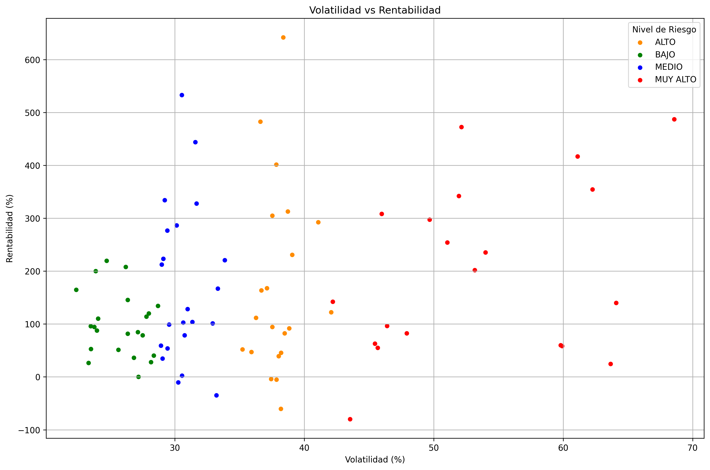
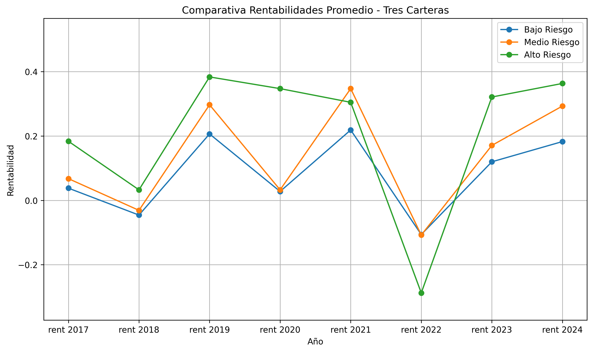
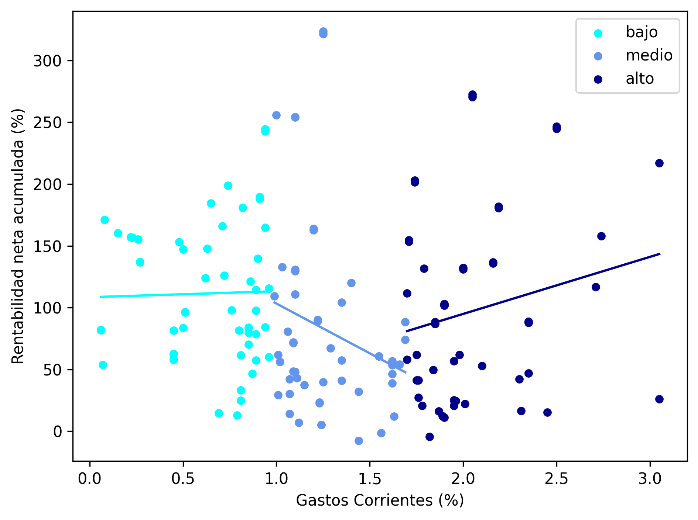
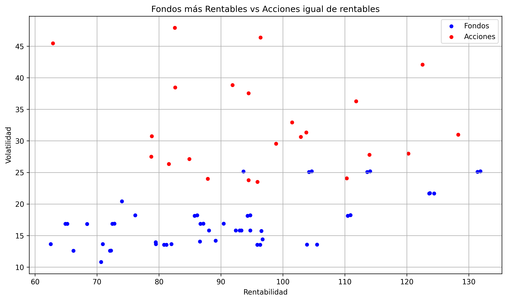

# Financial Data Scraping & Investment Analysis


## About The Project

This project combines **web scraping and financial data analysis** to explore the relationship between **risk, returns, and investment strategies** in financial markets.

Using automated scraping with **Selenium**, the project collects data from financial platforms (Yahoo Finance and Morningstar) and builds datasets of:

* **Technology sector stocks**
* **Highly rated technology investment funds**

The collected data is then processed and analyzed using **Python (Pandas, NumPy, Matplotlib)** to study several investment questions.

**Key Objective:**  
Compare the performance and risk profiles of **stocks vs investment funds** and explore how **fees, volatility, and portfolio construction affect long-term returns.**

### Key Features

* **Automated Data Collection:** Financial data scraped from public financial websites using Selenium.
* **Data Cleaning Pipeline:** Raw scraped data transformed into structured datasets for analysis.
* **Risk vs Return Analysis:** Exploration of volatility-return relationships in technology stocks.
* **Portfolio Construction:** Simulation of diversified portfolios for different risk profiles.
* **Fees Impact Study:** Investigation of how fund fees affect long-term returns.
* **Stocks vs Funds Comparison:** Direct comparison of investment vehicles under similar risk conditions.

---

## Methodology & Results

The project follows a typical **data science workflow**:

1. **Data Collection**
   Automated scraping of stocks and funds data.

2. **Data Cleaning & Preparation**
   Raw scraped datasets are processed into structured datasets.

3. **Exploratory Data Analysis**
   Analysis of relationships between volatility, returns, and investment characteristics.

4. **Investment Strategy Analysis**
   Portfolio simulations and comparison between investment vehicles.

---

## Key Analysis Visualizations

### 1. Risk vs Return Relationship in Stocks

Technology stocks show a clear relationship between **higher volatility and higher potential returns**, highlighting the classic risk-return tradeoff.

<p align="center">
  
</p>

---

### 2. Portfolio Performance by Risk Profile

Simulated portfolios demonstrate how diversification across funds can produce different return profiles depending on the investor's risk tolerance.

<p align="center">
  
</p>

---

### 3. Impact of Fees on Fund Performance

Higher management fees do not necessarily guarantee higher returns. This analysis explores how **expense ratios relate to cumulative fund performance**.

<p align="center">
  
</p>

---

### 4. Stocks vs Funds Comparison

A direct comparison between individual stocks and investment funds shows how different vehicles perform under similar return conditions.

<p align="center">
  
</p>

---

## Reproducibility Note

The web scraping scripts were developed in **late 2024**, based on the structure of Yahoo Finance and Morningstar at that time.

Because financial websites frequently update their **HTML structure and anti-scraping mechanisms**, the scraping scripts may require adjustments to run successfully today.

For reproducibility purposes, the **datasets generated during the original execution are included in the repository** within the `data/` folder. This allows the analysis notebooks to be executed without running the scraping process again.

---

## Project Structure

```bash
financial-webscraping-analysis/
│
├── src
│   ├── accion.py                # Stock data structure
│   ├── fondo.py                 # Fund data structure
│   ├── scraping_acciones.py     # Yahoo Finance scraping
│   └── scraping_fondos.py       # Morningstar scraping
│
├── data
│   ├── raw                      # Raw scraped datasets
│   └── processed                # Clean datasets used in analysis
│
├── notebooks
│   ├── 01_clean_funds.ipynb
│   ├── 02_clean_stocks.ipynb
│   ├── 03_stocks_risk_return.ipynb
│   ├── 04_stock_investment_strategies.ipynb
│   ├── 05_funds_fees.ipynb
│   ├── 06_funds_portfolios.ipynb
│   └── 07_funds_vs_stocks.ipynb
│
├── reports
│   └── figures                  # Visualizations used in the README
│
├── requirements.txt
└── README.md
```


---

## Getting Started

To explore the analysis locally:

1. **Clone the repository**

```bash
git clone https://github.com/drivash/financial-webscraping-analysis.git
```

2. **Install dependencies**

```bash
pip install -r requirements.txt
```

3. **Run the analysis notebooks**

```bash
jupyter notebook notebooks/
```

You can start with the main analysis notebooks such as:

```bash
03_stocks_risk_return.ipynb
06_funds_portfolios.ipynb
07_funds_vs_stocks.ipynb
```

---

## Author

**Daniel Rivas Hidalgo**
Data Science & Artificial Intelligence Student @ UPM

LinkedIn: [Daniel Rivas Hidalgo](https://www.linkedin.com/in/drivash05/)